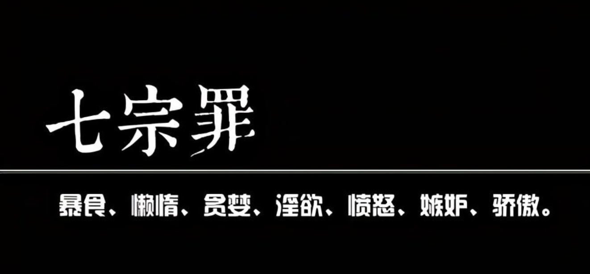
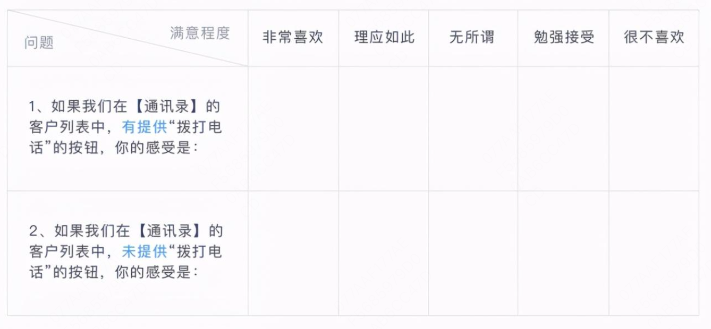
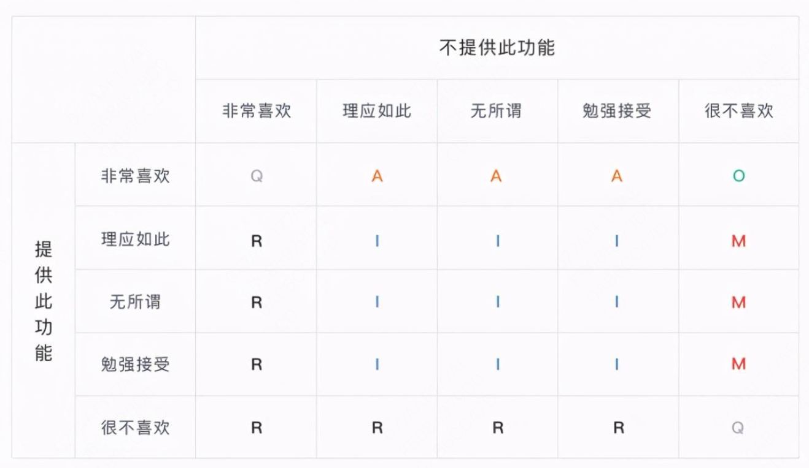
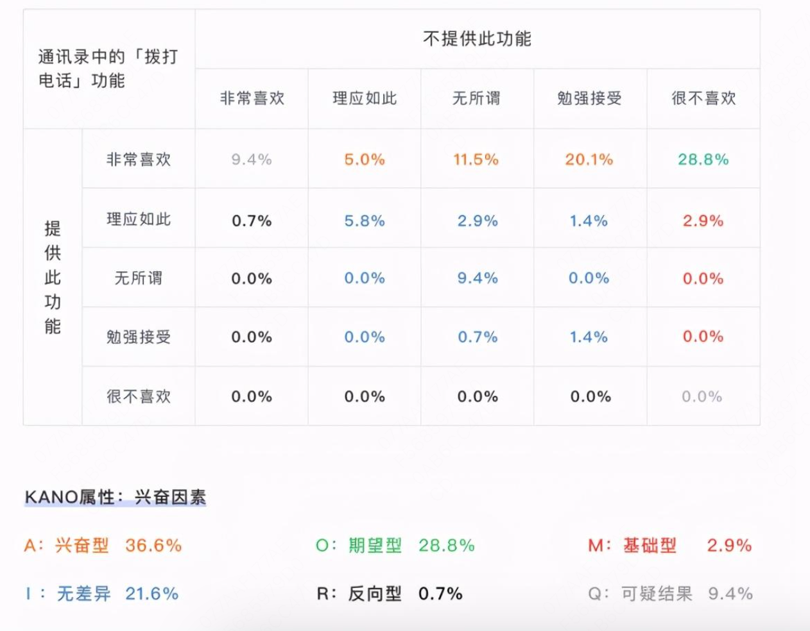
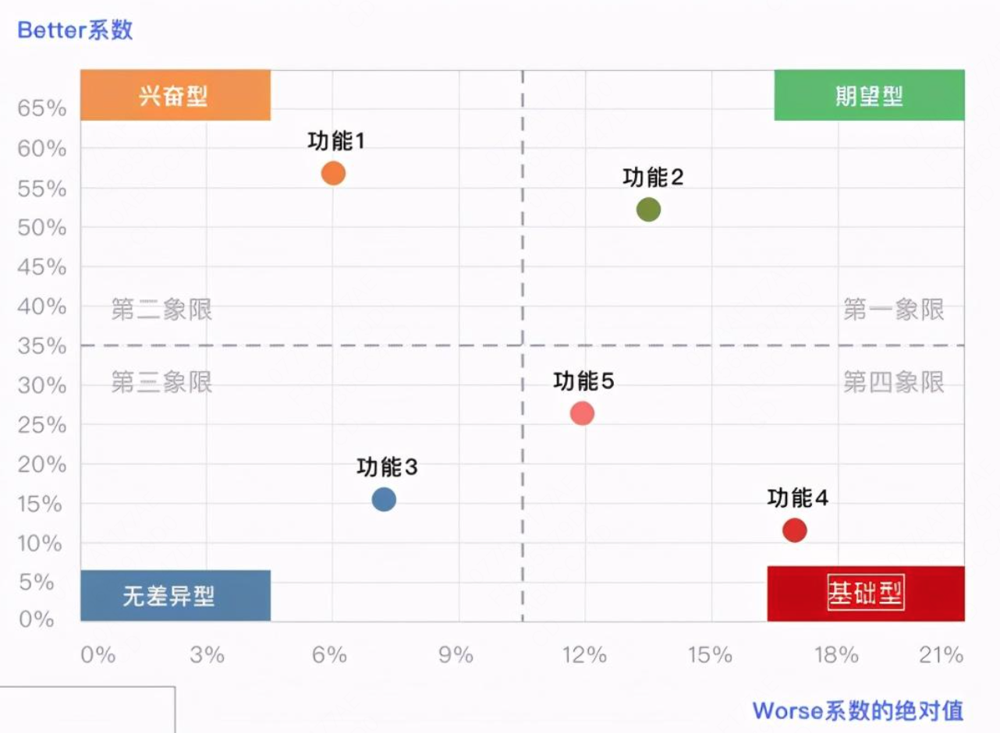
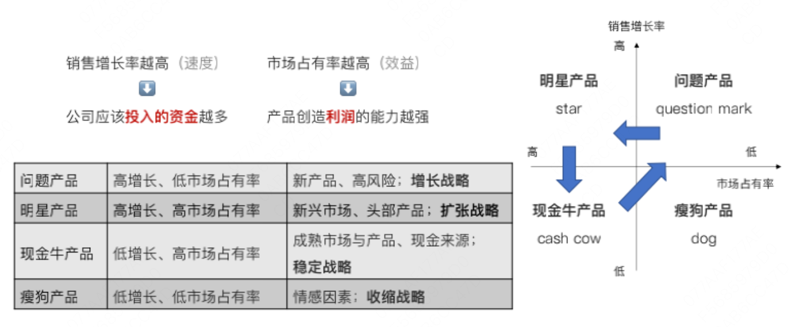
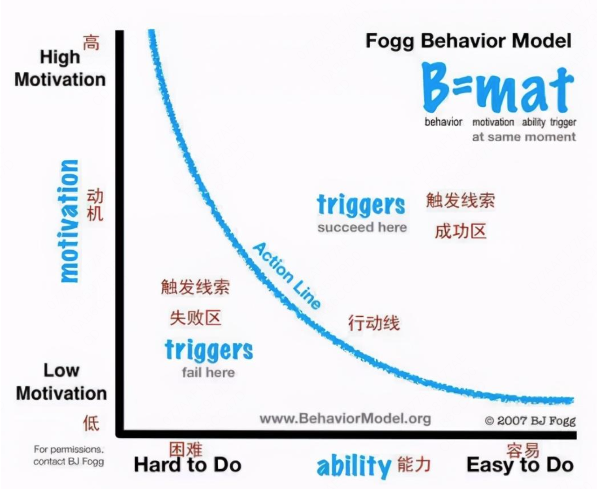
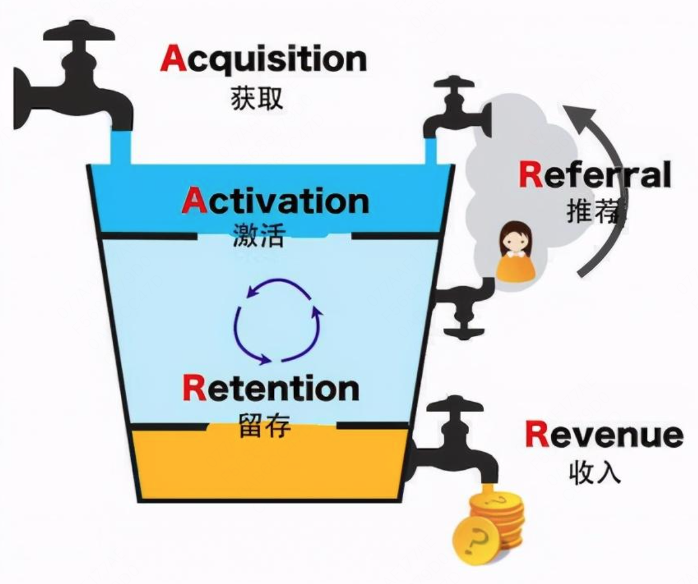

## 产品需求从哪里来
1. 马斯洛需求层次
2. 七宗罪：暴食、懒惰、贪婪、淫欲、愤怒、嫉妒、骄傲

<!--more-->

### 关于机会的判断
1. 痛点：痛点是恐惧
2. 痒点：痒点是满足虚拟自我(想象中那个理想的自己)
3. 爽点：爽点是快速获得，即时满足

### 需求分析法：卡诺(KANO)模型

根据不同类型的需求与⽤户满意度之间的关系，可将需求分为五类：基本型需求、期望型需求、兴奋型需求、⽆差异需求、反向型需求。

|需求类型 |备注 |如果实现 |如果不实现 |
|----|----|----|----|
|基本型需求 |MVP |用户满意度 提升不明显 |用户满意度 大大下降 |
|期望型需求 |竞争优势 |用户满意度 提升 |用户满意度 下降 |
|兴奋型需求 |提升忠诚度 |用户满意度 大大提升 |用户满意度 不降低 |
|无差异需求 |—— |用户满意度 不提升 |用户满意度 不提升 |
|反向型需求 |—— |用户满意度 降低 |用户满意度 提升 |

### 需求优先级如何确定？
1. 基础型>期望型>兴奋型>⽆差异型
2. 相同分类的需求，Better值越⼤，优先级越⾼

### 如何得到better值？
使⽤KANO模型可通过标准化问卷的⽅式进⾏需求调研问卷题⽬的设计，如下：
- 问卷中的每⼀道题⽬都要设计正反两⾯。
- 关于选项的说明：
⾮常喜欢：让你感到满意、开⼼、惊喜
理应如此：你觉得是应该的，必备的功能/服务
⽆所谓：⽆所谓喜不喜欢，都可以接受
勉强接受：你不喜欢，最好是没有，有的话勉强凑合
很不喜欢：让你感到不开⼼甚⾄沮丧，⽆法接受。

下图是问卷题⽬的评分对应表：

A: 兴奋型
O: 期望型
M: 基础型
I：无差异型
R: 反向型
Q: 可以结果
统计所有的合理数据，计算出各项的占⽐，数据最大的就是该需求的分类。
注：“通讯录中的拨打电话功能”这个需求的分类是：兴奋型36.6%，如果提供此功能，⽤户满意度⼤⼤提升，如果不提供此功能，⽤户满意度不降低

如果涉及多个需求的优先级排序，需要计算better-worse系数
Better=(A+O)/(A+O+M+I)
提供某功能以后的满意系数，正值。值越⼤（接近1），对⽤户的满意度影响越⼤
Worse=-1*(O+M)/(A+O+M+I)
移除某功能以后的不满意系数，负值。值越⼤（接近-1），对⽤户的不满意度影响越⼤

## 为什么要实现这些需求

产品的商业价值以及关于产品设计的顶层思考。
点：个体努⼒所能换来的回报，单点的业务突破。
线：将有价值的个体串联起来，注重线性优化。
⾯：开放的协同⽹络，对传统的供应链是典型的降维打击。打开传统供应链中的封闭结构，纳⼊更多的点。讲好⼀个平台的故事：淘宝、拼多多、滴滴、美团、携程、⽠⼦⼆⼿⻋
体：在“⾯”扩张的过程中衍⽣出更多的“⾯”，进⽽形成经济体。千亿美元市值公司应该考虑的问题（阿⾥）。
Q1思考：当你想要做⼀个新产品的时候，最好从什么⼊⼿（点/线/⾯/体）？
Q2思考：为什么跟谁学做O2O(2014)失败了、做B2C⽹校(2018)反⽽却成功了？
### 产品设计的顶层思考：波特三种竞争战略
|战略|英文|特点|
|----|----|----|
|成本领先战略 |Cost Advantage |价格敏感型；规模经济；供应链优化； |
|差异化战略 |Differentiation |独特的产品；忠诚的客户关系；持续创新能力； |
|细分市场战略 |Segmentation |细分的市场；聚焦的目标客户群体；小池里的大鱼； |
思考：在你的⽇常⼯作⽣活中，有哪些场景是在不⾃觉地采⽤这三种思维模型的？

### 产品设计的顶层思考：迈尔斯和斯诺分析模型
| || |
|-----|-----|-----|
|探索者 |Prospector |痴迷于增长，高风险倾向，颠覆性创新 |
|分析者 |Analyzer |快速跟进者，像素级模仿与微创新，成本更低/产品更好 |
|防御者 |Defender |成熟市场，稳定的市场份额，对金品敏感，长期规划 |
|回应者 |Reactor |无法控制企业的外部环境，被动做出响应和改变 |

### 产品设计的顶层思考：波士顿矩阵(BCGMatrix)分析法

波⼠顿矩阵，“销售增⻓率-市场占有率”矩阵，是⼀种分析公司产品组合的⽅法，以适应市场需求的变化。

- 销售增长率越高(速度) -> 公司应该投入的资金更多
- 市场占有率越高(效益) -> 产品创造利润的能力越强

| |||
|----|----|----|
|问题产品 |高增长、低市场占有率 |新产品、高风险：增长战略 |
|明星产品 |高增长、高市场占有率 |新兴市场、头部产品：扩展张略 |
|现金牛产品 |低增长、高市场占有率 |成熟市场与产品、现金来源：稳定战略 |
|瘦狗产品 |低增长、低市场占有率 |情感因素：收缩战略 |

## 做好一款产品有哪些小建议

### 任务拆解：MECE

### 产品设计：Fogg行为模型(FBM)

B=MAP，Behavior=Motivation+Ability+Prompt
⼈的⾏为是由动机，能⼒，触发条件三要素组成的。三要素同时满⾜才会产⽣⾏为。
通俗来说，⼀个⼈不做某件事，要么是不想做（没动机），要么是不能做或者不会做（没能⼒），要么就是忘了做（没触发）
⽤户的转化⾏为，发⽣在动机很强、成本很低的时候。
也就是下图阈值的上方，当然有的时候，动机强和成本低两者不可能完全满足，这时就要保证不能出现成本又高，用户动机又不够的设计。

#### 动机 Motivation

a.感觉：追求快乐、远离痛苦
b.期待：拥有希望、逃避恐惧
c.归属感：渴望被认同、害怕被拒绝
#### 能力/成本 Ability/Simplicity

用户有能力完成转化，说白了就是成本在他可以接受的范围内。
Fogg 认为用户最在乎的是成本。
 **与其用更多的诱惑增加他做一件事的动机，不如思考降低他做这件事的成本。** 
a. 时间
b. 金钱
c. 体力劳动: 相比走两个小时的路而言，打车就会显得更简单。
d. 脑力劳动: 有些人就是不喜欢动脑子，你让他答题得奖这件事就太复杂。
e. 社会压力: 如果要做有悖常理的事情，这个成本也会很高。
f. 习惯的力量: 如果要做这件事破坏了他日常的习惯，会有额外的成本。
#### 转化因素 Trigger

a. 刺激 Spark：当用户没有足够的动机时，需要用文字或者视频等，刺激用户产生动机。
b. 辅助 Facilitator：当用户已经有足够的动机了，但有的时候他不知道怎么做，⽤户有⼀定的动机但是不知道该怎么做，需要耐⼼地引导
c. 信号 Signal：⽤户既有动机有知道该怎么做，只是需要⼀个提醒就够了。当然，如果这时候信号过量，也会起反效果
## 产品做完了，然后呢

### 评估产品能力：AARRR模型

### 量化用户价值：RFM模型
| |||
|----|----|----|
|Recency |最近一次“消费”时间 |消费时间距离现在越近的用户价值越大 |
|Frequency |“消费”频率 |经常购买的用户比偶尔来一次的用户价值大 |
|Monetary |“消费”金额 |消费越多的用户价值越大 |

（M的高低来区分重要程度。R+F 区分剩下的维度）

|用户分群类型 |R |F |M |用户等级 |
|----|----|----|----|----|
|重要价值用户 |高 |高 |高 |A |
|重要发展用户 |高 |低 |高 |A |
|重要保持用户 |低 |高 |高 |B |
|重要挽留用户 |低 |低 |高 |B |
|一般价值用户 |高 |高 |低 |B |
|一般发展用户 |高 |低 |低 |B |
|一般保持用户 |低 |高 |低 |C |
|一般挽留用户 |低 |低 |低 |C |

观点⼀：做⼤部分互联⽹产品，都要尽量从⾼频、低价场景着⼿。在线班课业务不⾼频，⼀对⼀业务不低价。
观点⼆：RFM只是⼀种思维模型，这三个⽤户价值指标可以根据具体的⾏业、产品、场景灵活变通，进⾏矩阵分析。⽐如报名期次、班次/科次等。另外，也可以只挑其中两个维度进⾏⽤户价值的⼆维分析。

## 转自
https://www.toutiao.com/i6931591781884756492/?tt_from=weixin&utm_campaign=client_share&wxshare_count=1&timestamp=1613898142&app=news_article&utm_source=weixin&utm_medium=toutiao_android&use_new_style=1&req_id=20210221170222010131075157491F816B&share_token=d3dac16a-9785-4b56-8f4e-72e5b4c6bae0&group_id=6931591781884756492